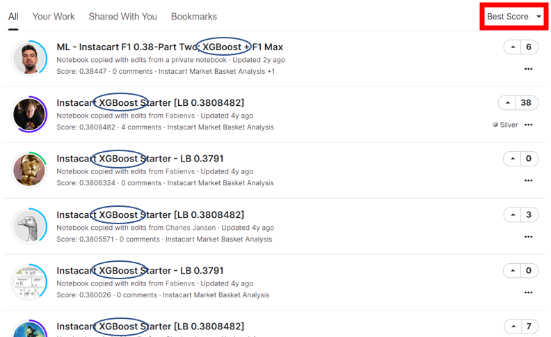

```{r setup, include=FALSE}
knitr::opts_chunk$set(echo = TRUE)
```

# Instacart Market Basket Analysis {.tabset}
[Kaggle Source](https://www.kaggle.com/c/instacart-market-basket-analysis)

## The Problem

Instacart, a grocery order and delivery app, wants to use its 3 million order records to predict which of the products that have been previously bought will be included in the costumers next order. Doing so would give instacart the capacity to adjust their recommendation system and become more efficient in their inventory management. 


## Existing Model Critiques

### Main Model- XGBoost.

Pros:

* Strong predictive power. 
* Relevant feature creation such as reorder probability and reorder ratios. 
* Uses Kaggles best performing algorithm. 
* Easy interpretability.

Cons:

* Lack of documentation through data wrangling. 
* Had to reduce the size of training set to 10% due to lack of computational power.


### Model Comparison

*  Majority of the submissions had a very similar implementation of XGBoost.
*  Differences only in feature creation not in model architecture.
*  Each model had its own independent variables, making it harder to replicate and compare.
*  Two types of models: Supervised(XGBoost) and unsupervised (K-Means)
*  Top models were run with XGBoost as seen in the picture below:



## Data Preparation and Cleansing

### Loading the Data

```{r, results='hide', message=FALSE, warning=FALSE}
start_time <- Sys.time()
installIfAbsentAndLoad <- function(neededVector) {
  for(thispackage in neededVector) {
    if( ! require(thispackage, character.only = T) )
    { install.packages(thispackage)}
    require(thispackage, character.only = T)
  }
}

needed <- c( 'e1071', 'ROCR', 'tidyverse', 'dplyr', 'tidyr', 'data.table', 'caret', 'xgboost','Ckmeans.1d.dp','randomForest')  
installIfAbsentAndLoad(needed)
```

A total of 6 csvs were required for the analysis:

* orderp: all prior orders for all users
* ordert: the most recent order for each user
* products: details about all products (product name, aisle, department)
* departments: department ids and names
* aisles: aisle ids and aisle names

Together, these 6 csvs combine to make over 6.5 million rows of 22 features, but most of these features must be mathematically derived from the few features present in the csv files.

```{r}
orderp  <- read.csv('order_products__prior.csv')
ordert <- read.csv('order_products__train.csv')
products <- read.csv('products.csv')
orders <- read.csv('orders.csv')
departments <- read.csv('departments.csv')
aisles <- read.csv('aisles.csv')
```

### Reshaping data 

We made categorical data into factors, then consolidated product level information by joining product with aisle and department. We then joined order-level data such as order number and time to which user and product an order was purchased during.

```{r}
aisles$aisle <- as.factor(aisles$aisle)
departments$department <- as.factor(departments$department)
orders$eval_set <- as.factor(orders$eval_set)
products$product_name <- as.factor(products$product_name)

products <- products %>% 
  inner_join(aisles) %>% inner_join(departments) %>% 
  select(-aisle_id, -department_id)
rm(aisles, departments)
head(products)

ordert$user_id <- orders$user_id[match(ordert$order_id, orders$order_id)]

orders_products <- orders %>% inner_join(orderp, by = "order_id")

rm(orderp)

head(orders_products)
```


### Product-level features


A group_by is used to get just one row for each pair of user_ID and Product. The mutate function is used afterwards to create a new column that keeps a count of the number of times an element has been ordered by a costumer.

Next, the data frame is grouped by product_id and new columns are created for each product.

* The total number of times a product was ordered
* The total number of times that a product was reordered
* The number of unique users that ordered a product
* The number of users that reordered a product

```{r}
prd <- orders_products %>%
  arrange(user_id, order_number, product_id) %>%
  group_by(user_id, product_id) %>%
  mutate(product_time = row_number()) %>%
  ungroup() %>%
  group_by(product_id) %>%
  summarise(
    prod_orders = n(),
    prod_reorders = sum(reordered),
    prod_first_orders = sum(product_time == 1),
    prod_second_orders = sum(product_time == 2)
  )
```


Using the above information, we can then calculate probabilities ratios for our feature extraction. This is important as it allows us to use product level detail in feature analysis.

Three more columns are added to the prd data frame:

* The probability that a product is reordered at least once
* The average number of times a product was reordered 
* A ratio of the number of reorders divided be the total orders  

```{r}
prd$prod_reorder_probability <- prd$prod_second_orders / prd$prod_first_orders
prd$prod_reorder_times <- 1 + prd$prod_reorders / prd$prod_first_orders
prd$prod_reorder_ratio <- prd$prod_reorders / prd$prod_orders

prd <- prd %>% select(-prod_reorders, -prod_first_orders, -prod_second_orders)
rm(products)
head(prd)
```

### User-level features

Every user's last order is identified as either train or test. All other orders are designated as *prior*. These *prior* orders are what will be used to make predictions on the *train* orders.

We group by users and calculate the following features for each user:

* The number of orders
* How long a user has been using Instacart
* How often a user orders from Instacart

```{r}
users <- orders %>%
  filter(eval_set == "prior") %>%
  group_by(user_id) %>%
  summarise(
    user_orders = max(order_number),
    user_period = sum(days_since_prior_order, na.rm = T),
    user_mean_days_since_prior = mean(days_since_prior_order, na.rm = T)
  )
```

Now, we add the following user-level columns:

* Total products ordered
* Reorder ratio of total reorders to total products
* Total distinct products ordered
* The average basket size

```{r}
us <- orders_products %>%
  group_by(user_id) %>%
  summarise(
    user_total_products = n(),
    user_reorder_ratio = sum(reordered == 1) / sum(order_number > 1),
    user_distinct_products = n_distinct(product_id)
  )

users <- users %>% inner_join(us)
users$user_average_basket <- users$user_total_products / users$user_orders

```

We now add a feature which is only relevant to the most recent (the test and training) order: time since last order.

```{r}
us <- orders %>%
  filter(eval_set != "prior") %>%
  select(user_id, order_id, eval_set,
         time_since_last_order = days_since_prior_order)

users <- users %>% inner_join(us)
rm(us)
head(users)
```

### Combining all tables

This Creates the data table by grouping order-products by user_id and product_id.
For each combination of user_id and product_id, create the following features: 

* Number of orders
* The first and last order where the user orders a specific product
* the average position in the cart that an item is added to an order
  + This tells us whether the product was an afterthought or the reason the user placed an order. 


```{r}
data <- orders_products %>%
  group_by(user_id, product_id) %>% 
  summarise(
    up_orders = n(),
    up_first_order = min(order_number),
    up_last_order = max(order_number),
    up_average_cart_position = mean(add_to_cart_order))
rm(orders_products, orders)
```

This adds all columns from the prd data frame and the users data frame into the users table
Rows from prd and rows from users will be repeated for each instance or product and user
respectively. These rows are not unique.

``` {r}
data <- data %>% 
  inner_join(prd, by = "product_id") %>%
  inner_join(users, by = "user_id")
```

Creates final features: 

* How frequently a user orders a product
* How many orders have passed since the last time a product was ordered
* How frequently a product has been ordered since the first time it was ordered

``` {r}
data$up_order_rate <- data$up_orders / data$user_orders
data$up_orders_since_last_order <- data$user_orders - data$up_last_order
data$up_order_rate_since_first_order <- data$up_orders / (data$user_orders - data$up_first_order + 1)

data <- data %>% 
  left_join(ordert %>% select(user_id, product_id, reordered), 
            by = c("user_id", "product_id"))
rm(ordert, prd, users)
head(data)
```

Some variables in this model would be too highly correlated to both be 
the included in analysis (ex. up_orders and up_order_rate). Both indicate the same thing,
the likelihood of a product being ordered; however, since boosting allows for strongly-correlated variables to be included, they can be included in this model.


### Train/Test Split

Remove the test set, since it cannot be evaluated 

``` {r}
data1 <- as.data.frame(data[data$eval_set == "train",])
rm(data)
```

Performing a train/test split was highly difficult due to the nature of the dataset, and none of the normal methods worked. We were required to randomly assign train and test labels to each user at an 80/20 ratio. We first had to select distinct user IDs and randomly assign them train and test labels at an 80/20 ratio. Then we joined these labels onto the original dataset, so that each row had a train and test label, then filtered on this label.

``` {r}
set.seed(10)
groups <-
  data1 %>%
  select(user_id) %>%
  distinct(user_id) %>%
  rowwise() %>%
  mutate(group = sample(
    c("newtrain", "newtest"),
    1,
    replace = TRUE,
    prob = c(0.8, 0.2) 
  ))

newdata <- data1 %>%
  left_join(groups)

train <- as.data.frame(newdata[newdata$group == "newtrain",])
test <- as.data.frame(newdata[newdata$group == "newtest",])
```

We then removed unnecessary columns and performed further cleaning to prepare for boosting.

```{r}
train$eval_set <- NULL
train$group <- NULL
train$order_id <- NULL
train$reordered[is.na(train$reordered)] <- 0

test$eval_set <- NULL
test$group <- NULL
test$order_id <- NULL
test$reordered[is.na(test$reordered)] <- 0
```

## Random Forest
Random forests or random decision forests are an ensemble learning method for classification, regression and other tasks that operates by constructing a multitude of decision trees at training time and outputting the class that is the mode of the classes or mean/average prediction of the individual treesCan be used in binary classification problems where the model either shows a 0 or 1.

**Pros:**

* Random Forests can be used for both classification and regression tasks.
* Random Forests work well with both categorical and numerical data. No scaling or transformation of variables is usually necessary.
* Random Forests are not influenced by outliers to a fair degree. It does this by binning the variables.
* Random Forests can handle linear and non-linear relationships well.
 
**Cons:**

* Random Forests are not easily interpretable. They provide feature importance but it does not provide complete visibility into the coefficients as linear regression.
* Random Forests can be computationally intensive for large datasets.
* Random forest is like a black box algorithm, you have very little control over what the model does.

### Model Setup

To compare a standard Random Forest model, only 2% of the training set was used for the model as our computer machines were unable to handle the entirety of the data. 2% is still 135,000 data, so it still could build a model with it.

```{r}
set.seed(10)


subtrain <- train %>% sample_frac(0.02) 

RF <- randomForest(as.factor(reordered) ~ .,
                   data=subtrain,
                   ntree=500,
                   mtry=4,
                   importance=TRUE, 
                   replace=T)

```

### Variable Importance Plot

``` {r}
varImpPlot(RF,type=2)
```

### Making Predictions

```{r}
test$RFpred = predict(RF, newdata=test)
```

### Confusion Matrix

```{r}
(confmat <- table(test$RFpred, test$reordered)[2:1, 2:1])
test$RFpred <- as.factor(test$RFpred)
test$reordered <- as.factor(test$reordered)
```

```{r, echo=FALSE}
table1 <- data.frame(confusionMatrix(test$RFpred, test$reordered)$table)
plotTable <- table1 %>%
  mutate(Performance = ifelse(table1$Prediction == table1$Reference, "Correct", "Incorrect")) %>%
  group_by(Reference) %>%
  mutate(prop = Freq/sum(Freq))

ggplot(data = plotTable, mapping = aes(x = Reference, y = Prediction, fill = Performance, alpha = Freq)) +
  geom_tile() +
  geom_text(aes(label = Freq), vjust = .5, fontface  = "bold", alpha = 1) +
  scale_fill_manual(values = c(Correct = "green", Incorrect = "red")) +
  theme_bw() +
  xlim(rev(levels(table1$Reference))) + 
  ggtitle("Confusion Matrix")
```

### Test error rate

```{r}
calc_error_rate <- function(confusion_matrix) {
  return(1 - sum(diag(confusion_matrix)) / sum(confusion_matrix))
}
e1 <- calc_error_rate(confmat)
cat("Test Error Rate: ", e1)
```

### F-Score

```{r}
sensitivity <- confmat[1]/(confmat[1]+confmat[2])
precision <- confmat[1]/(confmat[1]+confmat[3])
f1 <- 2 * (precision * sensitivity)/(precision + sensitivity)
cat("F1 Score: ", f1)
```

The model was able to perform with an error rate of under 10% and receive an F1 score in the .27 range. This model performed well, but not as well as XGBoost model.  


## XGBoost

Used for any classification problem. Specially useful if you have too many features and too large datasets, outliers are present, there are many missing values and you don’t want to do much feature engineering

Pros: 

* Less feature engineering required (No need for scaling, normalizing data, can also handle missing values well)
* Feature importance can be found out(it output importance of each feature, can be used for feature selection)
* Outliers have minimal impact.
* High f1 performance will show the effectiveness of your models ability to predict

Cons: 

* Harder to tune as there are too many hyperparameters.
* Overfitting possible if parameters not tuned properly.
* Difficult interpretation , visualization tough
 
### Model Setup

The following parameters were used for the xgboosting model. The selected parameters for this model was set up to make the model more conservative. Only 10% of the training set was used for the boosting model. An xgboosting matrix was created without columns that are unusable in the model like user and product ID. Then this matrix is used in an xgboosting model, which trains for 90 rounds. For this model we tried 4 different settings but the model didn't improve any further. We concluded that the original setting we made were the most efficient to train our model.

```{r}
set.seed(10)
params <- list(
  "objective"           = "reg:logistic",  # learning objective
  "eval_metric"         = "logloss",   # to account for negative log-likelihood
  "eta"                 = 0.1,         # used to prevent overfitting, and after each boosting step we get new weights and features.
  "max_depth"           = 5,           # involves the model complexity, used to decrease overfitting
  "min_child_weight"    = 10,          # the minimum sum of instances weight needed.
  "gamma"               = 0.70,        # is the minimum loss reduction required to make a further partition on a leaf node of the tree 
  "subsample"           = 0.77,        # is a ration of the training instances, and in this case would take a random sample of 77% of the data
  "colsample_bytree"    = 0.95,        # is the subsample ratio of columns when constructing each tree
  "alpha"               = 10e-05,      # L1 term on weight of the model
  "lambda"              = 10           # L2 regularization term on weights
)

# We get a sample containing 10% of the train table
subtrain <- train %>% sample_frac(0.1)
# We create an xgb.DMatrix that is named X with predictors from subtrain table and response the reordered variable
X <- xgb.DMatrix(as.matrix(subtrain %>% select(-c(reordered, user_id, product_id))), label = subtrain$reordered)
# We create the actual model
model <- xgboost(data = X, params = params, nrounds = 90)
```

### Variable Importance Plot

``` {r}
importance <- xgb.importance(colnames(X), model = model)
xgb.ggplot.importance(importance)
```

### Making Predictions

0.22 was used as the threshold of whether a product was reordered. 

```{r}
set.seed(10)
X <- xgb.DMatrix(as.matrix(test %>% select(-c(reordered, user_id, product_id, RFpred))))

# The model estimates a probability. We apply a threshold so every prediction above 0.22 will be considered as a reorder (reordered=1)
test$predictions <- predict(model, X)
test$predictions <- (test$predictions > 0.22) * 1
```

### Confusion Matrix

```{r}
(confmat <- table(test$predictions, test$reordered)[2:1, 2:1])
test$predictions <- as.factor(test$predictions)
test$reordered <- as.factor(test$reordered)
```

```{r, echo=FALSE}
table1 <- data.frame(confusionMatrix(test$predictions, test$reordered)$table)
plotTable <- table1 %>%
  mutate(Performance = ifelse(table1$Prediction == table1$Reference, "Correct", "Incorrect")) %>%
  group_by(Reference) %>%
  mutate(prop = Freq/sum(Freq))

ggplot(data = plotTable, mapping = aes(x = Reference, y = Prediction, fill = Performance, alpha = Freq)) +
  geom_tile() +
  geom_text(aes(label = Freq), vjust = .5, fontface  = "bold", alpha = 1) +
  scale_fill_manual(values = c(Correct = "green", Incorrect = "red")) +
  theme_bw() +
  xlim(rev(levels(table1$Reference))) + 
  ggtitle("Confusion Matrix")
```

### Test Error Rate

```{r}
calc_error_rate <- function(confusion_matrix) {
  return(1 - sum(diag(confusion_matrix)) / sum(confusion_matrix))
}
e2 <- calc_error_rate(confmat)
cat("Test Error Rate: ", e2)
```

### F-score

```{r}
sensitivity <- confmat[1]/(confmat[1]+confmat[2])
precision <- confmat[1]/(confmat[1]+confmat[3])
f1b <- 2 * (precision * sensitivity)/(precision + sensitivity)
cat("F1 Score: ", f1b)
```

Even only using 10% of the training set, and therefore 8% of the total dataset, the model was able to perform with an error rate of less than 15% and recieve an F1 score in the .4 range. This model performed excellently. 


## Conclusions

### Overall Conclusions

#### Model Results

**Error Rate vs. F1**
An Error rate of ~10% can be achieved by predicting no reorders.

```{r}
total_reordered <- mean(test$reordered==1)
cat('Percent of total Produts Reordered: ', total_reordered)
```

**Random Forest vs. XGBoost**

```{r}
tab <- matrix(c(e1, f1, e2, f1b), ncol=2, byrow=T)
colnames(tab) <- c("Test Error", "F-Score")
rownames(tab) <- c("Random Forest", "XGBoost")
tab <- as.table(tab)
print(tab)
```

Why does XGBoost outperform random forest?

* How trees are built:
  + RF builds each tree independently of the others
  + XGB learns from previous trees in building the next tree
* Combining results:
  + RF combines results at the end of the process with majority rules
  + XGB combines results along the way
* Other advantages of XGBoost over standard gradient boosting
  + Parallel Processing
  + Regularization to avoid overfitting


#### Runtime
```{r}
end_time <- Sys.time()
total_time = end_time - start_time
cat('Total time to compile markdown:', total_time, "minutes.")
```

### Reproducibility 

* Models
  + Clearly described both models, their input parameters, and their complexity
* Datasets
  + Included all 6 csv files in our analysis
  + Thoroughly explained feature engineering, with rationale, to enable recreation
  + Like to the datasets can be found here: [Source](https://www.kaggle.com/c/instacart-market-basket-analysis)
* Experimental Results
  + Specified Hyperparameters used in obtaining best result
  + Clear description of results and evaluation metrics used
  + Included graphs of relevant statistics
  + Energy cost of running both models

## References

* [Source](https://www.kaggle.com/c/instacart-market-basket-analysis)
* (https://www.kaggle.com/evangeloskalampokis/predictive-business-analytics-with-instacart)
* (https://www.kaggle.com/soutou/instacart-xgboost-starter-lb-0-3808482)
* (https://www.kaggle.com/stansilas/simple-mba-using-r)
* (https://www.kaggle.com/c/instacart-market-basket-analysis/code?competitionId=6644&sortBy=scoreDescending)

  
